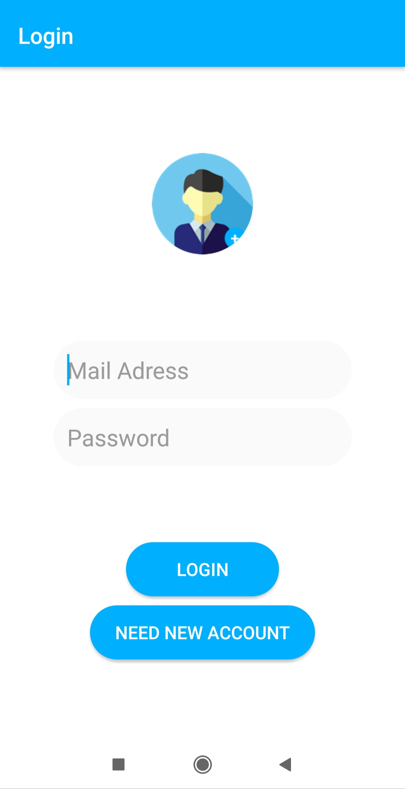
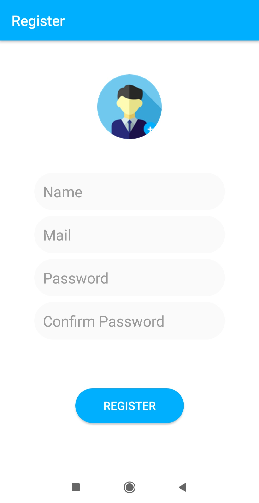
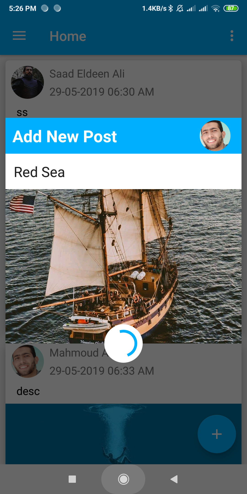
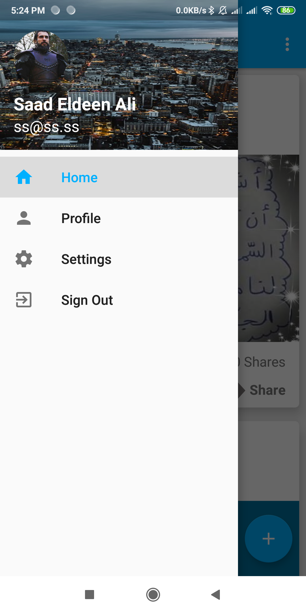
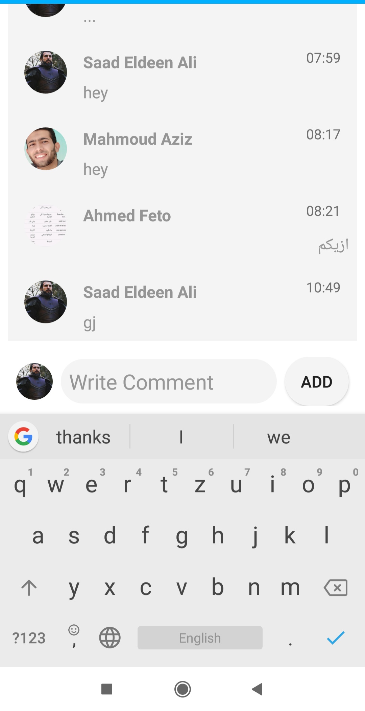

# Blog-App
A simple Blog app implemented using Firebase Backend

Features Implemented
==================
<ul>
<li>User Login, SignUp and User Authentication</li>
<liAdd post with Image and description</li>
<li>Main news feed which displays all the posts posted by all the users</li>
<li>Comment and like feature for posts</li>
</ul>

  
  
